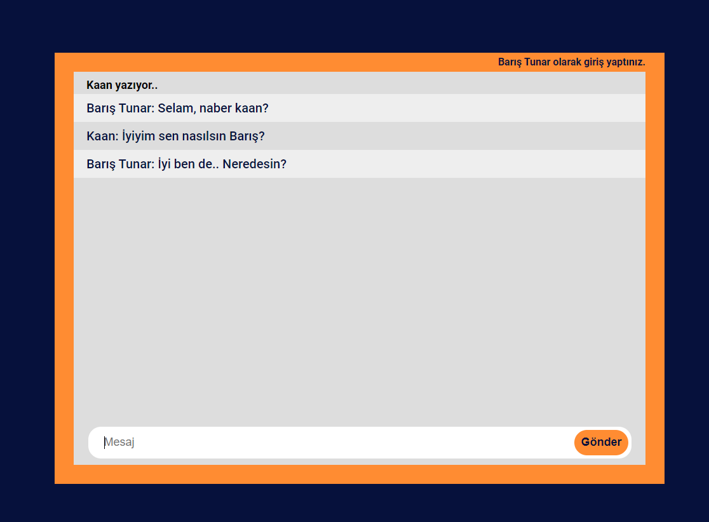

#Real Time Chat

##Introduction
A chat application that I developed while learning Socket.io. Users can chat with each other through the same channel. I used express.js and socket.io for development that app.

##Deployment Link
https://real-time-chat-bt.herokuapp.com/

##Installation
If you haven't installed [node.js](https://nodejs.org/en/) before, you should install [node.js](https://nodejs.org/en/) first.
* Clone
`
git clone https://github.com/baristunar/real-time-chat
`
 
* Install Dependencies
`
yarn install
`
 
* Start server
`
yarn start
`

##Useful Links

[Socket.io](https://socket.io/docs/v4/)
[Express](https://expressjs.com/)

##Contact

If you want to give a feedback, you can reach me via tunarbaris7@gmail.com